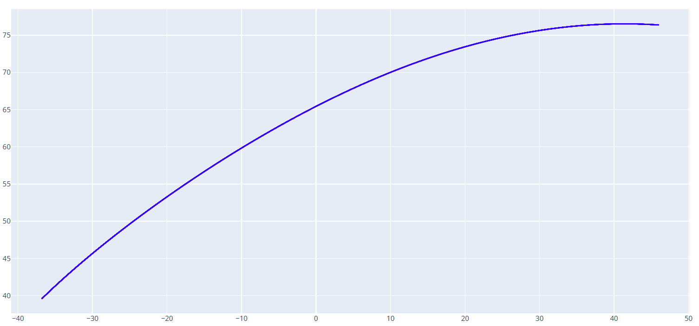

# 凸轮曲线转公式方程

给定凸轮的完整或者部分曲线，可以使用此工具推导出这段曲线的公式方程。

可选拟合模式：**傅里叶级数、多项式**。

## 凸轮曲线文件

此处需要导入 DXF 格式的凸轮曲线文件，曲线可以是完整的凸轮，也可以是升程或降程部分曲线单独进行推导。

## 拟合模式

可选 `傅里叶级数/多项式`，根据需求选择合适的拟合模式。

对于完整的凸轮闭合曲线推荐使用**傅里叶级数**模式，对于凸轮部分曲线推荐使用**多项式**模式。

## 最大拟合误差

设置拟合的公式方程和原始曲线的最大误差，单位:mm。

设置的误差值越小，拟合精度越高，但是公式的复杂度会变大。反之，设置的误差值越大，拟合精度越低，但是公式的复杂度会变小。

## DXF 保存地址

定义输出的公式方程的文件路径。

---

以下是一个示例凸轮曲线：


傅里叶级数模式拟合公式方程数据如下：
```
============================================================
拟合曲线方程:
============================================================
傅里叶级数形式 (参数方程, t ∈ [0, 2π]):

X(t) = a₀ + Σ(aₖcos(kt) + bₖsin(kt))
Y(t) = c₀ + Σ(cₖcos(kt) + dₖsin(kt))

具体系数:

X(t) = 19.995219 - 62.609527*cos(1*t) - 63.693169*sin(1*t) + 0.794602*cos(2*t) - 0.286369*sin(2*t) + 1.518229*cos(3*t) + 2.020756*sin(3*t) + 0.044945*cos(4*t) + 0.360793*sin(4*t) - 0.440389*cos(5*t) - 0.264710*sin(5*t) - 0.173415*cos(6*t) - 0.086907*sin(6*t) - 0.024759*cos(7*t) + 0.003241*sin(7*t) - 0.062999*cos(8*t) - 0.009002*sin(8*t) - 0.054942*cos(9*t) + 0.000334*sin(9*t) - 0.021396*cos(10*t) - 0.001659*sin(10*t) - 0.019031*cos(11*t) - 0.006992*sin(11*t) - 0.016603*cos(12*t) - 0.000699*sin(12*t) - 0.009423*cos(13*t) - 0.000246*sin(13*t) - 0.009808*cos(14*t) - 0.002390*sin(14*t) - 0.007632*cos(15*t) - 0.000806*sin(15*t) - 0.004676*cos(16*t) + 0.000075*sin(16*t) - 0.005051*cos(17*t) - 0.000964*sin(17*t) - 0.004012*cos(18*t) + 0.000205*sin(18*t) - 0.002464*cos(19*t) - 0.000228*sin(19*t) - 0.002560*cos(20*t) - 0.000625*sin(20*t)

Y(t) = -17.404440 + 53.582987*cos(1*t) - 74.500201*sin(1*t) - 0.515140*cos(2*t) - 0.636159*sin(2*t) - 1.252424*cos(3*t) + 2.254524*sin(3*t) - 0.211004*cos(4*t) + 0.418503*sin(4*t) + 0.290324*cos(5*t) - 0.278566*sin(5*t) + 0.221620*cos(6*t) - 0.036026*sin(6*t) + 0.072071*cos(7*t) + 0.044510*sin(7*t) + 0.034871*cos(8*t) - 0.026614*sin(8*t) + 0.034951*cos(9*t) - 0.019390*sin(9*t) + 0.023335*cos(10*t) + 0.000535*sin(10*t) + 0.015779*cos(11*t) - 0.005892*sin(11*t) + 0.013776*cos(12*t) - 0.003270*sin(12*t) + 0.009478*cos(13*t) - 0.000022*sin(13*t) + 0.006904*cos(14*t) - 0.002570*sin(14*t) + 0.006688*cos(15*t) - 0.001568*sin(15*t) + 0.004713*cos(16*t) + 0.000442*sin(16*t) + 0.003651*cos(17*t) - 0.001413*sin(17*t) + 0.003657*cos(18*t) - 0.000496*sin(18*t) + 0.002800*cos(19*t) + 0.000280*sin(19*t) + 0.001768*cos(20*t) - 0.000351*sin(20*t)

谐波数: 20

最大误差: 0.025374
平均误差: 0.003167
============================================================
```

截取其升程段的曲线：



多项式模式拟合公式方程数据如下：
```
============================================================
拟合曲线方程:
============================================================
多项式参数方程形式 (t ∈ [0, 1]):

X(t) = 9.201996*t^6 - 10.395235*t^5 - 8.498595*t^4 + 16.959702*t^3 + 4.218393*t^2 - 88.429130*t + 37.110499

Y(t) = 1.848295*t^6 - 17.323869*t^5 + 19.960135*t^4 + 14.157023*t^3 - 53.384137*t^2 - 5.213101*t + 76.406734

多项式度数: 6

最大误差: 0.005629
平均误差: 0.001603
============================================================
```