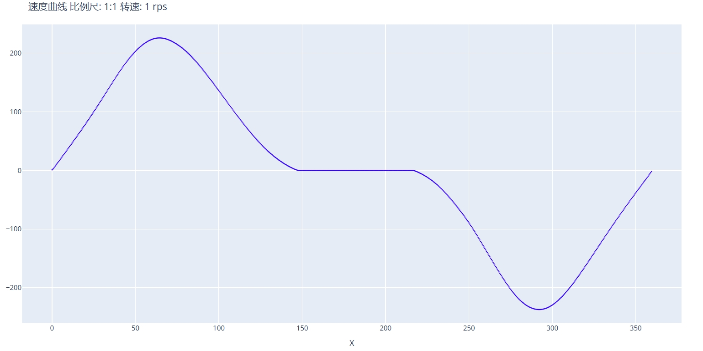

# 速度转升程曲线

如果已知一条速度/加速度曲线，可以计算出对应凸轮的升程曲线。

- 速度曲线需要提供 DXF 格式的文件，X 轴定义从 0 - 360 度的角度范围，Y 轴定义各个角度下的速度值，单位为 `转/秒`。
- 加速曲线格式和速度曲线一致，Y 轴定义各个角度下的加速度值，单位为 `转/秒^2`。

以下是一条典型的速度曲线曲线：

## 速度曲线文件

此处需要导入 DXF 格式的速度/加速度曲线文件，曲线绘制格式必须满足以上提到的要求。

## 模式选择

可选 `速度/加速度`，根据导入的曲线实际类型选择。

## 工件转速

设置速度/加速度曲线对应与多大的工件转速，单位为 `转/秒`。

## 速度曲线方向

设置速度曲线中 X 轴的角度数据是以 X 轴正向为基准，按照顺时针方向还是逆时针方向定义的角度。

## 原始速度 X 轴缩放

此参数用于设置原始速度/加速度曲线的 X 轴坐标是否进行过缩放处理。标准情况下 x 轴范围为(0 - 360)。如果进行过 0.1 倍缩放，则速度曲线X轴范围为(0 - 36)，需要在此处设置 `0.1`。

## DXF 保存地址

定义输出的升程数据的文件路径。

---

输出的升程曲线可以使用 `升程转凸轮曲线` 工具生成凸轮曲线。