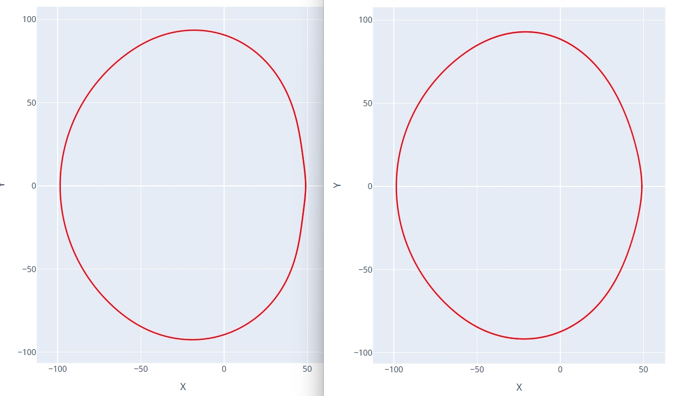

# CAM 图形变换

此工具用于将已有的凸轮 DXF 文件进行一定的变换生成新的凸轮曲线。

## 原始凸轮文件

输入一个凸轮 DXF 文件，用于图形变换。

## 尺寸变换值

设置凸轮放大或缩小的尺寸，正值为放大，负值为缩小。

## 尺寸变换模式

- 极径方向：以坐标原点为基准，原始凸轮曲线上每个角度下的的点沿着和圆心连线方向进行放大或缩小。此种方式生成的新凸轮和原始凸轮的升程曲线完全一致。
- 法线方向：原始曲线上每一点沿着曲线的法线方向进行放大或缩小。此种方式生成的新凸轮和原始凸轮生成曲线不一样。此方法可用于已知滚子中心轨迹生成凸轮轨迹，或者已知凸轮轨迹生成滚子中心轨迹。

以下图片中以同一个凸轮曲线进行操作，左边是极径方向缩小 50 mm，右边是法线方向缩小 50 mm：

## 比例系数

- **作用**：将原始曲线的 X、Y 坐标数据乘以一个比例系数。
- **设置建议**：如果导入的坐标数据和期望的数据比例尺不匹配，可以使用比例系数进行调整，输入负值可以进行镜像操作。

## 图形旋转角度

将生成的新凸轮曲线进行旋转操作，以X轴正向坐标轴为基准，顺时针为正，逆时针为负。

## DXF 保存地址

新凸轮的生成地址。
