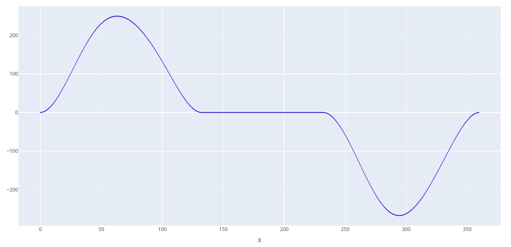
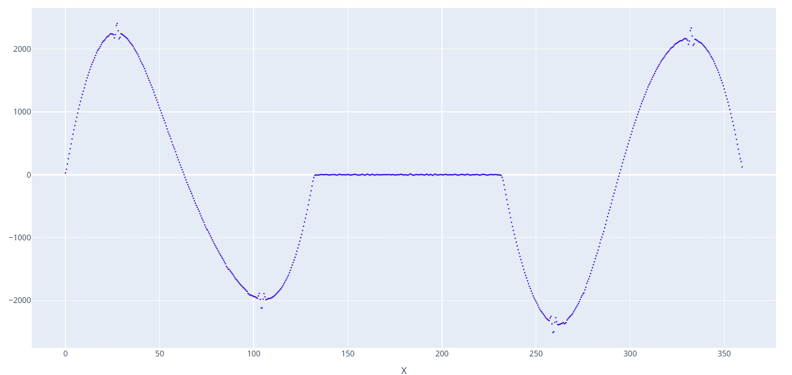

# XY 点位文件

使用此工具生成凸轮曲线文件，需要提前准备好包含 XY 形式坐标点的凸轮点位文件。

## XY 点位数据地址

此处输入 TXT 格式的点位文件地址。必须包含完整一圈的凸轮点位信息，且坐标点间距越小生成的凸轮曲线精度越高。

点位数据最简单的形式为：
```
15.0000  0.0000
14.8781  -0.3763
14.7518  -0.7512
14.6211  -1.1245
14.4860  -1.4963
14.3465  -1.8664
14.2026  -2.2349
14.0544  -2.6016
13.9018  -2.9666
13.7450  -3.3297
13.5839  -3.6909
13.4185  -4.0503
13.2489  -4.4076
13.0751  -4.7629
...
```

**Cam Grinding** 会自动判断每一行是否包含坐标点数据，如果没有则会自动忽略此行。

## XY 数据索引号

对于每一行的数据，可以自定义具体哪一个数据分别属于 X 和 Y 轴。默认值为 `01` 表示每行的第一个数据为 X 轴，第二个数据为 Y 轴。

对于以下数据，设置为 `56` 表示第六个数据为 X 轴，第七个数据为 Y 轴，且会自动跳过前几行不包含有效数据的行：
```
=====================================================================================
  t       a       V       s    Rbig      Xb       Yb      Rs       Xs       Ys
=====================================================================================
0.0000,0.0000,0.00000,0.0000,99.0800,-64.1672,-75.4945,148.5000,-100.1537,109.6426
1.0000,3.6884,0.00310,0.0001,99.0802,-62.8400,-76.6030,148.4998,-102.0518,107.8778
2.0000,7.2052,0.01220,0.0008,99.0818,-61.4944,-77.6894,148.4983,-103.9176,106.0796
3.0000,10.5532,0.02702,0.0026,99.0859,-60.1314,-78.7543,148.4943,-105.7495,104.2477
4.0000,13.7350,0.04728,0.0061,99.0938,-58.7519,-79.7985,148.4866,-107.5458,102.3825
5.0000,16.7532,0.07271,0.0118,99.1067,-57.3568,-80.8228,148.4741,-109.3048,100.4840
6.0000,19.6107,0.10304,0.0202,99.1256,-55.9469,-81.8280,148.4558,-111.0249,98.5526
7.0000,22.3099,0.13799,0.0316,99.1515,-54.5227,-82.8148,148.4307,-112.7044,96.5887
...
```

## 交换 XY 数据

可以设置是否交换 X 和 Y 轴的数据，默认为不交换。

此功能也可以通过交换 XY 数据索引号来实现。

## 图形旋转角度

可以将绘制的凸轮图形进行旋转操作，默认为 0 度，即不旋转。

输入正值为顺时针旋转，输入负值为逆时针旋转，单位为角度。

以下示例为不旋转和旋转 90 度效果：


## 绘制升程图形

可选在绘制凸轮曲线时同时输出升程信息，以及速度/加速度信息。

升程/速度/加速度等信息对凸轮设计至关重要，因此建议选择输出升程信息观察凸轮的各项指标是否符合设计要求。

示例的升程图形，可以观察升程大小以及每个角度下的升程变化趋势：


示例速度图形，通常情况下速度曲线平滑表面凸轮设计合理：


示例加速度图形，通常情况下加速度曲线平滑表面凸轮设计合理：


同时会输出一个 TXT 升程文件，例如：`xiaocam-distance-99_0800.txt`。此文件记录了每 0.5 度下的升程量，可用于克林伯格 P65 测量仪进行凸轮的测量。

## 基圆半径

基圆半径用于升程升程图形，需要根据凸轮实际数据进行设置，一般情况下升程最低的地方为基圆所在区域。

## 升程方向

以X轴正向坐标轴为基准，可选顺时针或逆时针方向绘制升程曲线，由于机床加工方向为顺时针方向，所以推荐生成顺时针方向生成曲线以便于对照。

## X 轴缩放

此参数用于输出的 html 图形中 X 轴坐标进行缩放处理。设置 0.1 则生成的 html X 轴数据会缩小到标准数据的 0.1 倍。

主要为了方便观察部分升程过小的曲线。

## DXF 保存地址

定义输出绘制完成的凸轮曲线文件路径，如果选择输出升程数据，也会在该目录下输出相关文件。

---

输出的 DXF 格式凸轮文件输入基本参数的 `凸轮 DXF 文件` 处，并生成加工代码。