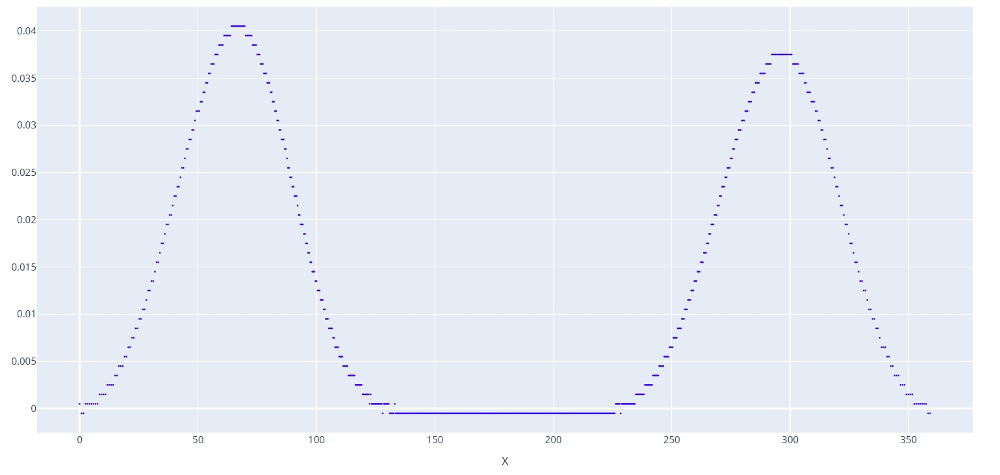

# 直径误差分析

此工具通过输入标准砂轮直径、实际砂轮直径和进刀尺寸变化，可自动分析出实际加工出的凸轮和标准相比会产生多大误差。用于实际加工出现误差后，判断是否是由于砂轮直径不准确或加工尺寸变化引起的。

## 标准凸轮文件

输入一个待分析的凸轮文件，文件格式为 `.dxf` 格式。

## 标准砂轮直径

输入当前砂轮的理论直径，也是加工程序中所调用的直径值，单位为 mm。

加工程序中使用变量 `WHEEL_DIA` 存储当前砂轮直径，不同的直径对应不同的加工代码，通过判断当前直径范围来调用对应的加工代码。

## 实际砂轮直径

此处输入实际砂轮直径，或者任意不同于理论砂轮直径的值，用于分析不同的直径误差会导致怎么样的加工误差。

## 进刀尺寸调整

可以验证相对于标准加工尺寸，多磨或少磨一定尺寸，最终加工出来的凸轮在每个角度下分别会产生多大的误差。

## DXF 保存地址

输出误差分析结果到文件。会同时输出包含砂轮直径误差及进刀尺寸误差后实际加工出来的凸轮曲线以及和标准凸轮曲线对比的误差曲线。

以下是实际砂轮直径比标准砂轮直径小 10 mm 的凸轮误差曲线：

可以观察到在 0-130 和 230-360 角度范围内，最大会产生 0.04 mm 的误差，实际效果就是这部分区域测量结果偏大。