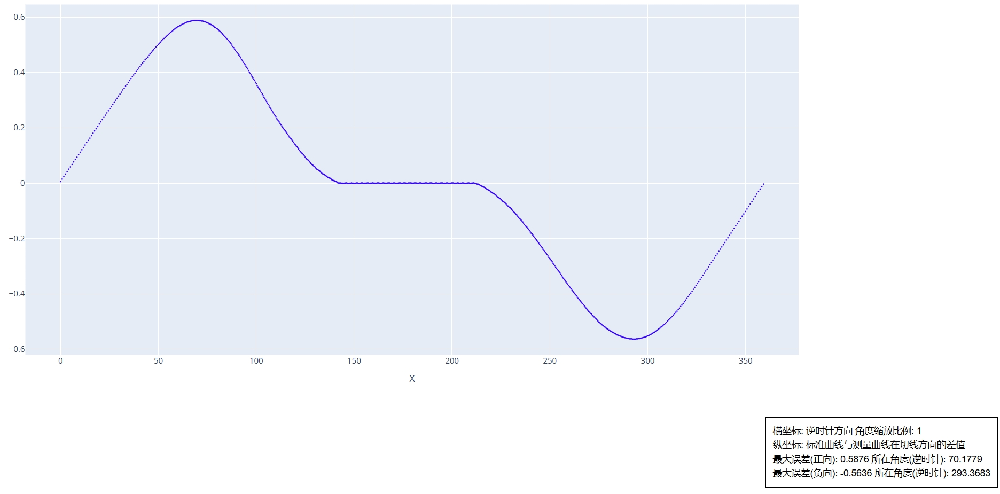

# CAM 误差对比

误差对比工具主要用于比较两个凸轮之间的差别，以`凸轮 1`为基准凸轮，曲线上每个点在法线上和`凸轮 2`的对应点的差值，用于评估两个凸轮之间的误差差异。

## 凸轮 1 (基准)

输入基准凸轮曲线 DXF 文件。

## 凸轮 2 (对比)

输入需要对比的凸轮曲线 DXF 文件。

## 最大误差距离

设置基准曲线上检测误差值时的最大检测距离。在满足最大误差的情况下设置的尽量小，避免误检测到过远区域的目标曲线上。

## DXF 保存地址

输出的误差曲线文件路径。

---

html 中可以观察到最大误差和最小误差值及其所在角度：
