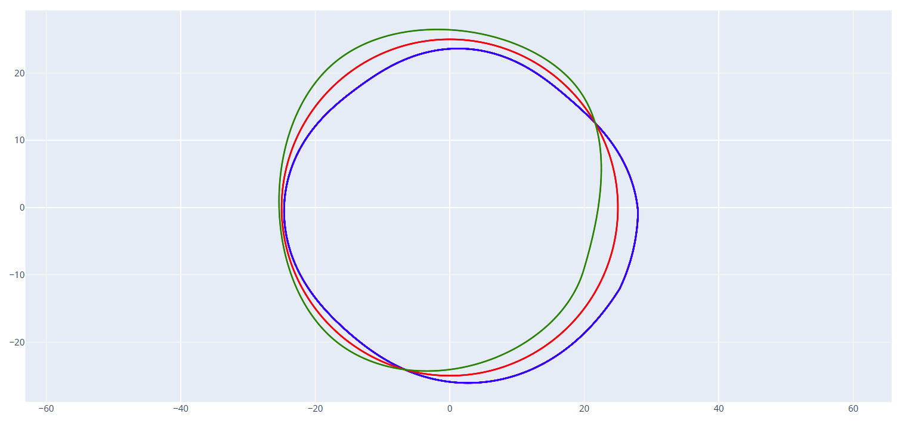

# 加工误差修正

加工误差修正是 **Cam Grinding** 的核心功能之一，它可以根据对比标准凸轮曲线、实际加工凸轮曲线和测量凸轮曲线，自动生成分析误差并新的修正后的加工凸轮曲线。

## 标准凸轮文件

输入最终想要加工出来的凸轮曲线 DXF 文件。

## 加工凸轮文件

输入实际加工中所使用的凸轮曲线 DXF 文件。如果是加工的第一件，则加工凸轮文件和标准凸轮文件应该是一致的。后续多次调整时需要输入上一次误差修正后的凸轮曲线，在此基础上进行二次补偿。

## 实测凸轮文件

输入通过测量仪实际测量出来的凸轮曲线 DXF 文件。如果是通过 P65 进行测量，需要通过 `CAM 误差叠加`工具生成实测凸轮文件。

## 原点平移

可以对实测凸轮文件进行一定的平移操作。一般对于使用三坐标测量仪测量后导出的包含 XY 坐标的数据文件生成的实测凸轮文件，由于测量仪对于基圆圆心计算不准确可能会导致图形整体偏移。在此情况下可以对实测凸轮文件进行一定的平移操作来解决此问题，平移距离可以在界面上进行调整。

## 加工尺寸补偿

对于实际加工后发现尺寸总体偏大或偏小的情况，可以使用此参数对实测凸轮文件进行尺寸缩放操作，方便后续误差修正。

## 数据旋转角度

对于实测凸轮文件和加工凸轮文件存在相位角度偏差的情况，可以使用此参数对实测凸轮文件进行旋转操作，方便后续误差修正。

## DXF 保存地址

输出误差修正后的凸轮曲线 DXF 文件。同时也会输出误差曲线文件，便于直观的查看误差分析结果。

使用修正后的凸轮曲线文件重新生成加工代码，并进行加工。