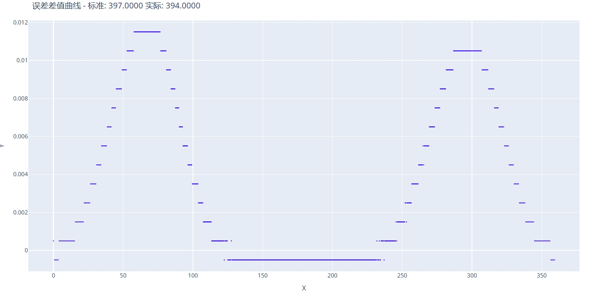

# 基本参数

基本参数中包含最常用的设置项，包括砂轮直径/直径间隔/凸轮 DXF 文件，以及输出文件夹等。下面逐项介绍参数含义及设置方法。

## 最大砂轮直径

机床 CNC 代码是通过控制砂轮架前后运动以及头架旋转运动实现凸轮的加工。实际上可以看作是控制砂轮轴中心点绕头架旋转运动。实际加工中是通过砂轮边沿和工件接触切削从而加工出凸轮轮廓。这其中涉及砂轮中心运动轨迹和砂轮边沿运动轨迹的区别，两者之间是以砂轮半径为宽度的轮廓线关系。因此，砂轮直径变化时砂轮中心运动轨迹也会变化，从而使得砂轮边沿运动轨迹符合凸轮设计曲线要求。

每当砂轮直径变化时，需要重新计算一组新的加工代码以满足加工精度的要求。Cam Grinding 提供了最大砂轮直径和最小砂轮直径的设置，软件会在这个区间内生成合适的加工代码。

根据实际安装的砂轮直径，设置 `最大砂轮直径` 参数，通常情况下，当前砂轮直径是多少，则最大砂轮直径就应设置为相同数值。请确保在机床中将砂轮实际直径与系统设置直径校准，否则实际加工可能会产生误差。

例如，当凸轮直径误差为 3mm 时，实际加工可能会产生约 0.012mm 的曲线误差：


## 最小砂轮直径

最小砂轮直径的设置值需要小于或等于最大砂轮直径。由于生成的加工代码会覆盖从最大砂轮直径到最小砂轮直径的范围，因此最小砂轮直径越小，生成的代码文件尺寸越大。通常情况下，应设置足够使用的直径范围即可。

## 砂轮直径间隔

此参数决定了砂轮直径每变化多少 mm 时，重新计算一组新的加工代码。设置值越小，直径误差引起的曲线误差越小，但生成的代码文件尺寸也会增加。推荐设置为 0.5 mm。

## 凸轮 DXF 文件

此处需要提供用于加工的凸轮 DXF 图纸，该图形必须为凸轮的轮廓线。加工方向应以沿着 X 轴正向为起点，顺时针加工。

典型的凸轮曲线示例：


## 输出程序路径

此参数用于设置加工代码的输出文件夹，软件会自动在该文件夹下创建一个子文件夹，名称格式为 `CV_凸轮DXF文件`，例如：`CV_CAMTEST`。

加工代码及相关输出文件将存放于该文件夹中，目录结构如下：
```
CV_文件名
├── 凸轮加工代码
├── 离散点化凸轮 DXF 文件
├── 多段线化凸轮 DXF 文件
├── 特定砂轮直径下加工运行轨迹
│   ├── 离散点化 DXF 文件
│   ├── 多段线化 DXF 文件
│   ├── 实际运行离散点坐标信息 TXT 文件
│   └── 凸轮曲线与加工运行曲线对比 HTML 文件
```

其中特定砂轮直径下的数据，即最终机床所运行的加工代码执行的加工轨迹。

将生成的凸轮加工代码复制到机床，即可进行加工。

